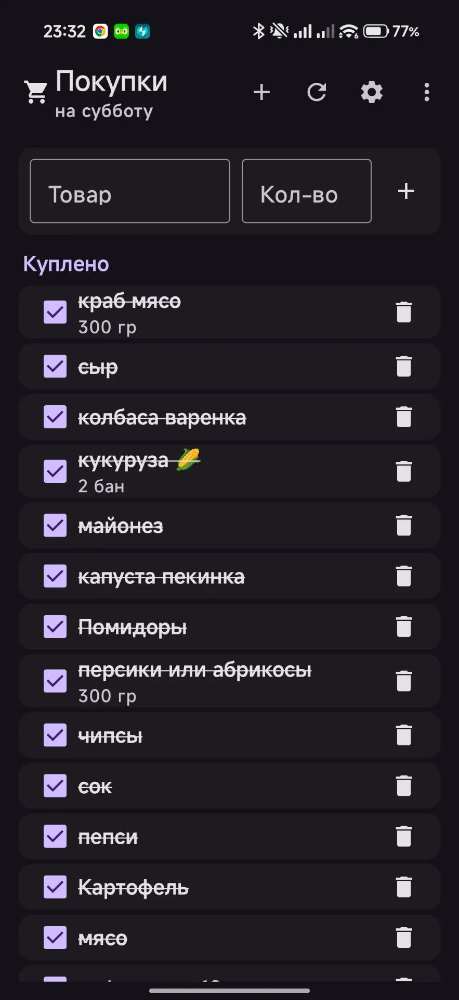
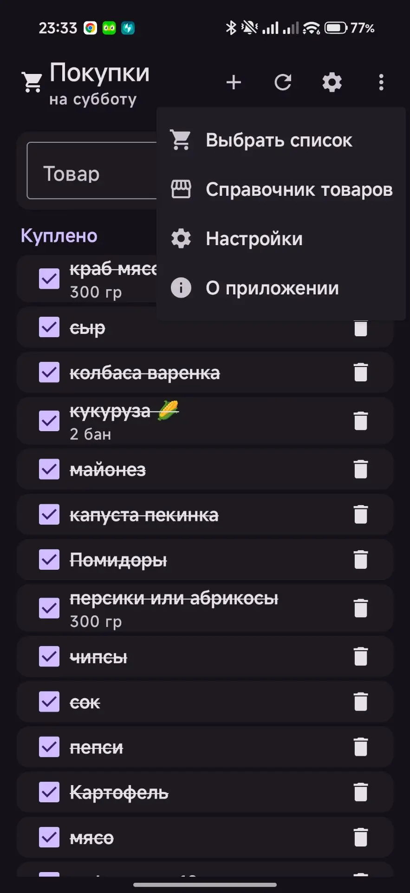
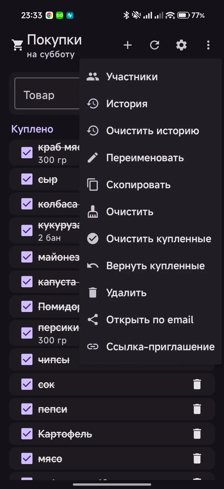
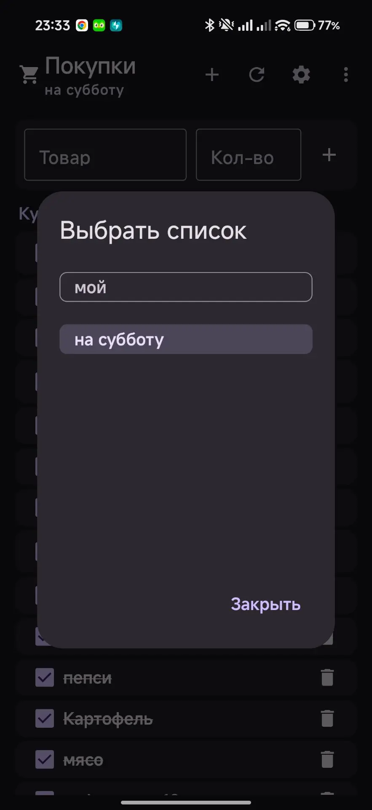
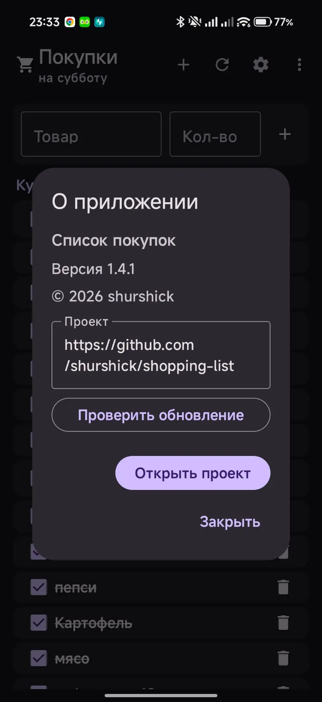
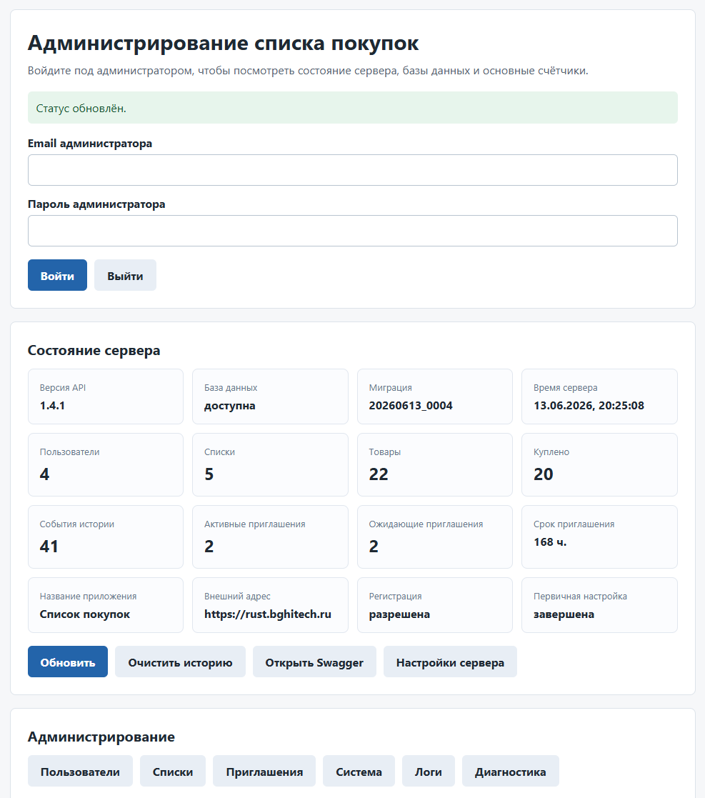

# Список покупок

Android-приложение и сервер синхронизации для совместных списков покупок. Сервер можно запустить на обычном Docker-сервере, VPS, домашнем Linux-сервере, NAS с Docker или через TrueNAS Custom App.

Проект рассчитан на самостоятельное размещение: ваши списки, пользователи и настройки хранятся на вашем сервере, а Android-приложение синхронизируется с ним при запуске и после изменений.

## Скриншоты

<p>
  
  
  
  
  
</p>

<p>
  
</p>

## Основные возможности

- регистрация и вход пользователей;
- обязательное создание администратора при первом запуске сервера;
- несколько списков покупок у одного пользователя;
- общий доступ к спискам между зарегистрированными пользователями;
- просмотр участников конкретного списка;
- история действий по каждому списку с очисткой истории;
- приглашение в список по одноразовой ссылке;
- срок действия ссылки-приглашения, по умолчанию 7 дней;
- переименование, копирование, очистка и удаление списков;
- удаление списка у не-владельца отключает только его доступ;
- добавление, редактирование, отметка и удаление товаров;
- офлайн-очередь изменений для действий со списком и товарами;
- идемпотентная отправка offline-операций, чтобы повтор после сетевого сбоя не создавал дубликаты;
- внутренняя архитектура backend и Android разделена на более понятные слои без изменения UX и API;
- понятный статус офлайн-режима, последней синхронизации и ожидающих действий;
- отмена удаления товара;
- разделение товаров на блоки "Купить" и "Куплено";
- очистка, возврат купленных товаров или полная очистка списка;
- справочник товаров с автопоиском и автоматическим пополнением при ручном добавлении позиции;
- экран настроек Android-приложения с адресом сервера, темой оформления и выходом из аккаунта;
- светлая, тёмная и системная тема Android-приложения;
- окно "О приложении" с версией, ссылкой на проект и проверкой обновлений;
- проверка обновлений Android-приложения через GitHub Releases при запуске: если доступна новая APK-версия, показывается компактное уведомление со ссылкой на релиз;
- отображение в админке версии Android-приложения, которую пользователь использовал при последней синхронизации;
- защищенное хранение токена входа в Android через EncryptedSharedPreferences;
- синхронизация при запуске приложения и после действий пользователя;
- веб-мастер настройки сервера по адресу `/setup`;
- CSRF-защита веб-мастера `/setup` и базовое ограничение частоты входа, регистрации и настройки;
- автоматические миграции базы данных при запуске контейнера API;
- расширенный `/health`, веб-страница администратора `/admin`, административная статистика `/admin/status` и очистка истории;
- публичная конфигурация сервера по адресу `/server-config`;
- готовые Docker Compose-файлы для разных сценариев запуска.

## Требования

### Android

- Минимальная версия Android: **Android 8.0 Oreo**.
- Минимальный API: **26** (`minSdk = 26`).
- Целевая версия сборки: **Android 15**, API **35** (`targetSdk = 35`).
- Установка выполняется APK-файлом из раздела Releases.

### Сервер

- Docker и Docker Compose.
- Доступ к порту API, по умолчанию `8000`.
- Для доступа из интернета рекомендуется домен и HTTPS через reverse proxy.
- Для хранения данных используется PostgreSQL.

Сервер можно запустить несколькими способами:

- локальная сборка из исходников через `docker-compose.yml`;
- сборка backend напрямую из GitHub через `docker-compose.github-build.yml`;
- готовый GHCR-образ через `docker-compose.ghcr.yml`;
- TrueNAS 25.04 Custom App через `docker-compose.truenas-custom.yml` с готовым GHCR-образом.

## Состав проекта

- `backend` - серверная часть на FastAPI и PostgreSQL.
- `android` - Android-приложение на Kotlin и Jetpack Compose Material 3.
- `docker-compose.yml` - локальный запуск сервера со сборкой из текущих файлов.
- `docker-compose.github-build.yml` - запуск со сборкой backend напрямую из GitHub.
- `docker-compose.ghcr.yml` - запуск готового backend-образа из GitHub Container Registry.
- `docker-compose.truenas-custom.yml` - YAML для TrueNAS 25.04 Custom App без отдельного `.env`, использует готовый GHCR-образ API.
- `docs` - подробные инструкции по API и вариантам развертывания.

## Быстрый запуск через Docker Compose

```bash
git clone https://github.com/shurshick/shopping-list.git
cd shopping-list
cp .env.example .env
```

Заполните `.env`:

```env
POSTGRES_PASSWORD=long-random-postgres-password
JWT_SECRET=long-random-jwt-secret
API_PORT=8000
INVITE_TOKEN_HOURS=168
```

Запустите:

```bash
docker compose up -d --build
```

Откройте мастер настройки:

```text
http://server-ip:8000/setup
```

## Запуск через готовый Docker-образ

Если нужен запуск без сборки backend на сервере, используйте `docker-compose.ghcr.yml`.

Создайте `.env` рядом с compose-файлом:

```env
POSTGRES_PASSWORD=long-random-postgres-password
JWT_SECRET=long-random-jwt-secret
API_PORT=8000
APP_VERSION=latest
INVITE_TOKEN_HOURS=168
```

Запустите:

```bash
docker compose -f docker-compose.ghcr.yml up -d
```

Образ сервера публикуется в GitHub Container Registry:

```text
ghcr.io/shurshick/shopping-list-api
```

## Запуск со сборкой напрямую из GitHub

Этот вариант удобен, если на сервере можно собирать Docker-образ:

```bash
mkdir -p shopping-list
cd shopping-list
curl -L \
  -o docker-compose.yml \
  https://raw.githubusercontent.com/shurshick/shopping-list/main/docker-compose.github-build.yml
```

Создайте `.env`:

```env
POSTGRES_PASSWORD=long-random-postgres-password
JWT_SECRET=long-random-jwt-secret
API_PORT=8000
INVITE_TOKEN_HOURS=168
```

Запустите:

```bash
docker compose up -d --build
```

Подробности: [docs/github-deploy.md](docs/github-deploy.md).

## Запуск на TrueNAS

Для TrueNAS 25.04.2.6 можно использовать Custom App или Install via YAML:

1. Откройте в TrueNAS раздел приложений.
2. Выберите Custom App или Install via YAML.
3. Вставьте содержимое файла `docker-compose.truenas-custom.yml`.
4. Запустите приложение.
5. Откройте мастер настройки:

```text
http://truenas-ip:8000/setup
```

Подробная инструкция: [docs/truenas-custom-app.md](docs/truenas-custom-app.md).

## Первичная настройка сервера

После запуска откройте:

```text
http://server-ip:8000/setup
```

При первом запуске сервер обязательно попросит создать администратора. Нужно указать email и пароль администратора, название приложения, внешний HTTPS-адрес и режим регистрации новых пользователей.

Позже настройки можно менять на той же странице `/setup`, введя email и пароль администратора.

## Android-приложение

APK публикуется в разделе [Releases](https://github.com/shurshick/shopping-list/releases).

При запуске Android-приложение проверяет последний релиз GitHub. Если опубликована новая APK-версия, вверху главного экрана появляется компактное уведомление с кнопкой открытия страницы релиза. Если GitHub недоступен, сеть отключена или ответ не удалось разобрать, приложение ничего не показывает и продолжает работать как обычно. APK не скачивается и не устанавливается автоматически.

При первом запуске приложения укажите адрес сервера, например:

```text
https://shopping.example.com
```

После входа приложение покажет выбранный список покупок. Кнопка `+` в верхней панели создает новый список, шестеренка открывает меню текущего списка, а основное меню содержит выбор списка, справочник товаров, настройки и сведения о приложении.

В меню списка доступны участники, переименование, копирование, очистка купленных товаров, возврат купленных товаров, полная очистка, удаление, доступ по email и одноразовая ссылка-приглашение. Нажатие на название товара открывает редактирование названия и количества.

Если сервер временно недоступен, приложение сохраняет изменения в локальную очередь и отправляет их при следующей синхронизации. Внизу списка отображается количество действий, ожидающих отправки на сервер.

Новые операции offline-очереди получают `client_operation_id`. Если сервер применил действие, но телефон не получил ответ, повторная отправка вернет прежний результат без создания дубликатов.

При синхронизации Android-приложение передает серверу версию клиента. В `/admin/users` видно последнюю версию приложения, код версии, платформу и время последней синхронизации пользователя. Старые клиенты без этих заголовков продолжают работать, для них поля остаются пустыми.

Токен входа хранится в защищенном хранилище Android. При обновлении со старой версии приложение переносит ранее сохраненный токен из обычных настроек в защищенное хранилище и удаляет старое значение. Пароль после входа или регистрации не сохраняется.

APK из публичных релизов подписывается постоянным ключом проекта. Если на телефоне установлена ранняя сборка и Android сообщает о конфликте пакетов, удалите старую сборку один раз и установите свежий APK. Последующие публичные версии должны устанавливаться поверх.

## Проверка Android-сборки

Android-сборка проверяется в GitHub Actions workflow `Android CI`. Workflow сам устанавливает JDK 17, использует Gradle cache, делает Gradle wrapper исполняемым и запускает:

```bash
./gradlew assembleDebug --stacktrace
```

Отсутствие Java/JDK в локальном окружении разработчика не считается ошибкой исходного кода. Если нужно собрать приложение локально, установите JDK 17 и запустите команду из папки `android`.

## Проверка серверной части

Backend проверяется отдельным GitHub Actions workflow `Backend CI`: устанавливается Python 3.12, зависимости сервера и тестов, запускаются pytest-тесты и Docker-сборка backend-образа.

Локальная проверка:

```bash
python -m pytest backend/tests
docker build backend
```

Тесты покрывают первичную настройку, запрет регистрации до настройки, вход с неверным паролем, rate limit, права администратора, запрет доступа к чужому списку, одноразовые приглашения, replay offline-операций, публичную конфигурацию без секретов и CSRF-защиту `/setup`.

## Доступ из интернета

Для доступа извне рекомендуется использовать домен и HTTPS через reverse proxy: Nginx Proxy Manager, Caddy, Traefik или аналогичный инструмент.

Не публикуйте API в интернет без HTTPS: приложение передает email, пароль и токены авторизации.

Сервер содержит базовое in-memory ограничение частоты запросов для входа, регистрации и мастера настройки. Оно помогает от случайного перебора паролей и повторных попыток, но сбрасывается при перезапуске контейнера. Для домашнего сервера этого достаточно как первого уровня защиты, а для публичного нагруженного сервера лучше дополнительно использовать HTTPS, reverse proxy и внешние ограничения на уровне прокси.

Веб-мастер `/setup` использует CSRF-токен и проверку `Origin`/`Referer` для HTML-формы. Мобильный API с Bearer-токеном CSRF-токен не требует.

## Обновление

Если сервер запущен через готовый образ:

```bash
docker compose -f docker-compose.ghcr.yml pull
docker compose -f docker-compose.ghcr.yml up -d
```

Если сервер собирается из GitHub:

```bash
docker compose build --pull
docker compose up -d
```

Для TrueNAS Custom App обновите YAML при необходимости и перезапустите приложение.

Контейнер API применяет миграции базы данных автоматически перед запуском сервера.

## Эксплуатация и диагностика v1.4.0

В релизе `v1.4.0` добавлены отдельные инструменты для обслуживания self-hosted сервера:

В `v1.4.4` эти разделы доступны прямо из веб-интерфейса `/admin` после входа администратором.

- `GET /health/live` - быстрая проверка, что процесс API запущен.
- `GET /health/ready` - проверка готовности API, подключения к БД и состояния миграций.
- `GET /health/db` - безопасная проверка БД без раскрытия строки подключения.
- `GET /metrics` - безопасные счетчики в JSON без email, токенов и секретов.
- `GET /admin/users` - список пользователей, блокировка, разблокировка и смена пароля.
- `GET /admin/lists` - просмотр списков, архивирование и восстановление.
- `GET /admin/invites` - просмотр и отзыв invite-ссылок.
- `GET /admin/system` - версия backend, БД, Alembic revision, uptime и режим регистрации.
- `GET /admin/logs` и `GET /admin/diagnostics` - последние события и диагностическая сводка.

CLI-команды обслуживания:

```bash
python -m app.cli backup --output backup.json
python -m app.cli backup --output backup-with-auth.json --include-auth-hashes
python -m app.cli restore --input backup.json
python -m app.cli db-status
```

Перед обновлением сервера рекомендуется сделать backup, обновить Docker image, перезапустить API и проверить `/health/ready` и `/admin/system`.

Подробные инструкции:

- [Эксплуатация сервера](docs/operations.md)
- [Backup и restore](docs/backup_restore.md)

## Полезные ссылки

- [Развертывание серверной части с GitHub](docs/github-deploy.md)
- [Развертывание через TrueNAS Custom App](docs/truenas-custom-app.md)
- [Эксплуатация сервера](docs/operations.md)
- [Backup и restore](docs/backup_restore.md)
- [Описание API](docs/api.md)
- [Архитектура проекта](docs/architecture.md)
- [Безопасность](SECURITY.md)
- [Релизы Android APK и серверных архивов](https://github.com/shurshick/shopping-list/releases)
